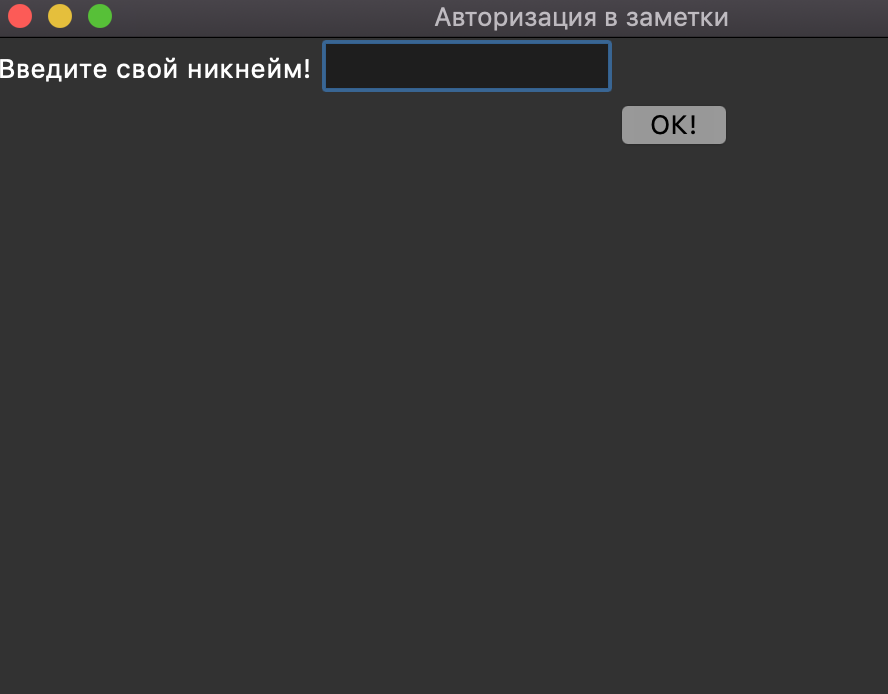
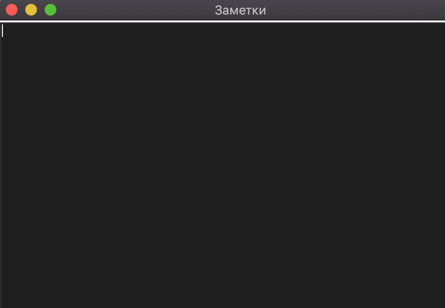
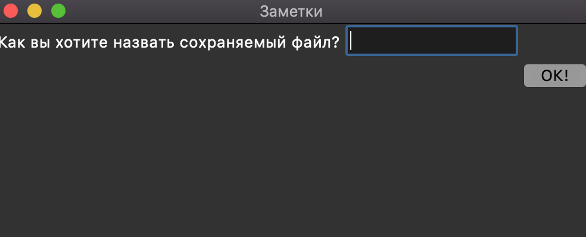

# Разработка простого приложения в виде заметок

# Техническое задание

Разработать приложение для создания, просмотра, регистрацией пользователей и управления заметками на Python с использованием графической библиотеки Tkinter.

## Результат работы

## Требования

1. Функциональность приложения:

   - Создание новых заметок.
   - Просмотр и редактирование выбранной заметки.
   - Сохранение заметок между сеансами работы приложения.
2. Технические требования

   - Python для разработки приложения.
   - Библиотека Tkinter для создания графического интерфейса.
3. Графический интерфейс:

   - Разработать графический интерфейс с использованием Tkinter, включая основное окно приложения, кнопки, поля ввода и элементы для отображения списка заметок.
4. Сохранение данных:

   - Заметки должны сохраняться в файле на локальном диске в формате, обеспечивающем сохранение текстовых данных (например, JSON).

5. Тестирование и отладка

   - Провести тестирование каждой функции приложения, включая создание, просмотр, редактирование и удаление заметок.
   - Обеспечить сохранение заметок между сеансами работы приложения.